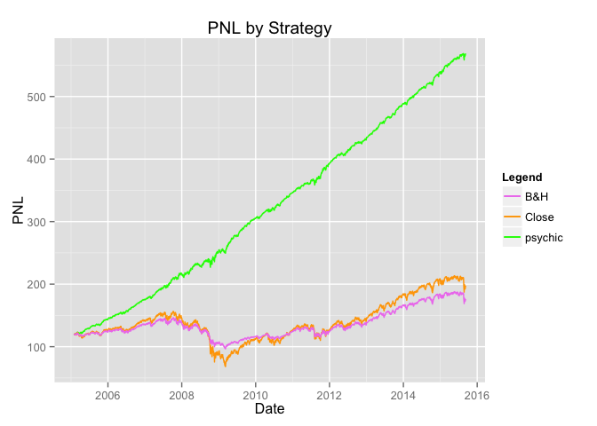

# Tax Loss Harvesting
# Tax Loss Harvesting

## Synopsis

## Preparations
### Data load and preprocessing
Load in the data from Yahoo and sort by date.

```r
library(dplyr)
library(ggplot2)

SPY <- read.csv('http://ichart.finance.yahoo.com/table.csv?s=SPY&a=1&b=1&c=2005&g=d&ignore=.csv')
SPY$Date <- as.Date(as.character(SPY$Date))
SPY$Year <- format(SPY$Date, "%Y")
SPY <- arrange(SPY, Date)

ggplot(SPY, aes(x=Date, y=Close)) + geom_line()
```

 

### Some useful definitions
#### Constants
Tax rates are based on Denmark.

```r
capitalGainsTax <- 0.27
marginalTax <- 0.56
```

#### Some useful functions

```r
# Calculates value of position if it was sold right now
# If positive, capital gains tax is applied.
# If negative, savings in tax from deductions are counted as positive
taxadjusted_value <- function(start_value, end_value) {
  gainloss <- end_value - start_value
  taxadjusted_gainloss <- pmax(0,gainloss)*(1-capitalGainsTax) + pmin(0,gainloss)*(1-marginalTax)
  return(start_value + taxadjusted_gainloss)
}
```

## Buy and hold
We find the PNL for buy and hold. I.e., assuming the position is simply held, what would its value be to the investor if sold at a given point in time (taking into account capital gains tax and tax deductions).


```r
library(dplyr)
```

```
## 
## Attaching package: 'dplyr'
## 
## The following objects are masked from 'package:stats':
## 
##     filter, lag
## 
## The following objects are masked from 'package:base':
## 
##     intersect, setdiff, setequal, union
```

```r
library(ggplot2)
start <- SPY[1,]$Close

SPY <- mutate( SPY, taxadjustedPNL = taxadjusted_value(start, Close))

(ggplot(data=SPY) 
  + aes(Date)
  + geom_line(aes(y=Close, colour='zero tax')) 
  + geom_line(aes(y=taxadjustedPNL, colour='adjusted'))
  + ylab('SPY')
  + ggtitle('Buy and Hold')
  + scale_color_manual(name='Legend',values=c('zero tax'='blue',adjusted='orange'))
 )
```

 

## Upper Bound for Tax Harvesting
We find a naive upper bound for the value of tax harvesting by applying the tax deduction to any daily loss even if subsequently offset by gains. Thus, losses and gains are tracked separately, the former used to deduct taxable income ad infinitum and the latter taxed by capital gains tax.

### Split PNL into loss and gain
We first create a data frame with daily PNL deltas.

```r
dates <- SPY$Date
vals <- SPY$Close
deltas <- data.frame(
  Date=dates[2:length(dates)],
  Close=vals[2:length(dates)],
  prevClose=vals[1:length(dates)-1]
)
deltas$Delta <- deltas$Close - deltas$prevClose # Recorded on day D, change in Close from D-1 to D
```


```r
deltas <- select(deltas,Date,Delta)
SPY <- left_join(SPY, deltas, by='Date')
SPY[is.na(SPY$Delta),'Delta'] <- 0 # First entry has no previous entry and thus no delta
SPY <- mutate(
    SPY, 
    cumGain=cumsum(pmax(0,Delta)), 
    cumLoss=cumsum(pmin(0,Delta)),
    upperboundPNL=start + taxadjusted_value(0,cumGain) + taxadjusted_value(0,cumLoss)
  )
```

Plotting this upper bound:

```r
( ggplot(data=SPY)
  + aes(x=Date)
  + geom_line(aes(y=upperboundPNL, colour='psychic'))
  + geom_line(aes(y=Close, colour='Close'))
  + geom_line(aes(y=taxadjustedPNL, colour='B&H'))
  + ylab('PNL')
  + ggtitle('PNL by Strategy')
  + scale_color_manual(name='Legend',values=c(psychic='green',Close='orange', 'B&H'='violet'))
)
```

 

## An attempt at tax harvesting
Tax-loss harvesting consists of separating losses and gains into separate years to take advantage in the different tax rates used when reducing income tax and applying capital gains tax.

In order to realize as much loss as possible, we realize gains or losses at least once a year. Whether to make the year a loss-year or a gains-year depends on whether the PNL hits a pre-chosen lower or upper bound first.


```r
gain_bound <- 0.06
loss_bound <- -0.03
```

Set up starting conditions:

```r
row_count <- dim(SPY)[1] 
first_row <- SPY[1,]
year <- first_row$Year 
last_reset_close <- first_row$Close # Value of Close last time we realized gains/losses

unrealized_pnl <- 0 # PNL which has not yet been taxed/deducted (realized)
realized_pnl <- 0 # PNL which has been taxed/deducted
pnl_actualized <- 0 # -1 for loss, 0 for not actualized, 1 for gain (records last tax realization)
pnl_vector <- vector(mode="numeric", length=row_count) # Daily PNL (assuming full sell-out)
```

### Monty on the Run

```r
for(row_index in 1:row_count) {
  row <- SPY[row_index,]
  new_year <- row$Year
  unrealized_pnl <- unrealized_pnl + row$Delta
  
  if(new_year != year) {
    year <- new_year
    if(pnl_actualized==0 || sign(pnl_actualized)==sign(unrealized_pnl)) {
      realized_pnl <- realized_pnl + taxadjusted_value(0,unrealized_pnl)
      unrealized_pnl <- 0
      last_reset_close <- row$Close
    } 
    pnl_actualized <- 0
  }
  
  close_change <- (row$Close - last_reset_close) / last_reset_close 
  if(pnl_actualized==0 && (close_change <= loss_bound || close_change >= gain_bound) ) {
    print(sprintf('Realizing on %s with change %f', row$Date, close_change))
    pnl_actualized <- sign(unrealized_pnl)
    realized_pnl <- realized_pnl + taxadjusted_value(0,unrealized_pnl)
    unrealized_pnl <- 0
  }
  
  pnl_vector[row_index] <- realized_pnl + taxadjusted_value(0,unrealized_pnl)[1]
}
```

```
## [1] "Realizing on 2005-04-15 with change -0.040030"
## [1] "Realizing on 2006-01-03 with change 0.065512"
## [1] "Realizing on 2007-05-03 with change 0.063521"
## [1] "Realizing on 2008-01-16 with change -0.031053"
## [1] "Realizing on 2009-01-09 with change -0.041631"
## [1] "Realizing on 2010-01-04 with change 0.219127"
## [1] "Realizing on 2011-04-26 with change 0.060921"
## [1] "Realizing on 2012-02-07 with change 0.060921"
## [1] "Realizing on 2012-02-08 with change 0.064069"
## [1] "Realizing on 2013-03-08 with change 0.064220"
## [1] "Realizing on 2014-01-29 with change -0.030450"
## [1] "Realizing on 2015-01-02 with change 0.123059"
```

Having the PNL vector we add it to the data frame.


```r
naive_value <- pnl_vector + first_row$Close
SPY <- cbind(SPY, naive_value)
```

And plot:

```r
( ggplot(data=SPY)
  + aes(x=Date)
  + geom_line(aes(y=Close, colour='Close'))
  + geom_line(aes(y=taxadjustedPNL, colour='B&H'))
  + geom_line(aes(y=naive_value, colour='naive'))
  + ylab('PNL')
  + ggtitle('PNL by Strategy')
  + scale_color_manual(name='Legend',values=c(naive='green',Close='orange', 'B&H'='violet'))
)
```

 

### Some Basic Data
Ending levels:

* Buy and hold: 176.2515062
* Naive: 199.3239033

Returns:

```r
years <- as.numeric(difftime(tail(SPY,n=1)$Date, first_row$Date)) / 365.25
start_close <- first_row$Close
bh_returns <- ( tail(SPY,n=1)$taxadjustedPNL - start_close) / start_close
bh_ann_rtns <- log(1+bh_returns)/years 

naive_returns <- ( tail(SPY,n=1)$naive_value - start_close) / start_close
naive_ann_rtns <- log(1+naive_returns)/years
```

* Buy and hold: 0.4822261, (ann. 0.0371331)
* Naive: 0.6762585, (ann. 0.0487407)
